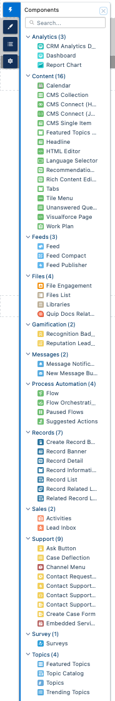

# Which components are available in which templates ?

## Summary


**Good to know:** a good vision statement shows the long-term goals of the company without getting too deep into strategy, implementation, or product specifics.


Our company vision is to **be the authoritative reference point for environmentally conscious buyers** and to **encourage more sustainable business practices** through curating beautiful, practical, consciously-produced products.

## LWR BYO build-your-own (7 components)

.png>)

## Customer Account (51 components)

****.png>)****

## **Help Center (32 components)**

.png>)

## Customer Service (62 components)

